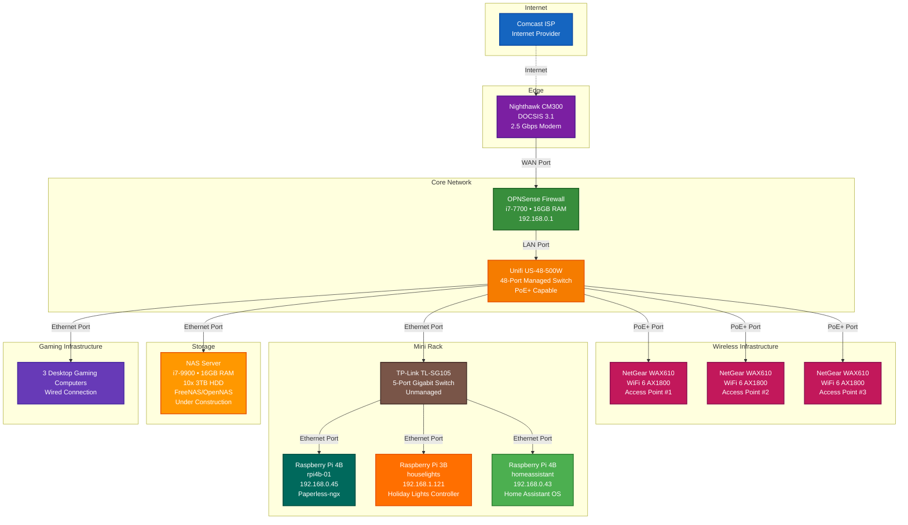
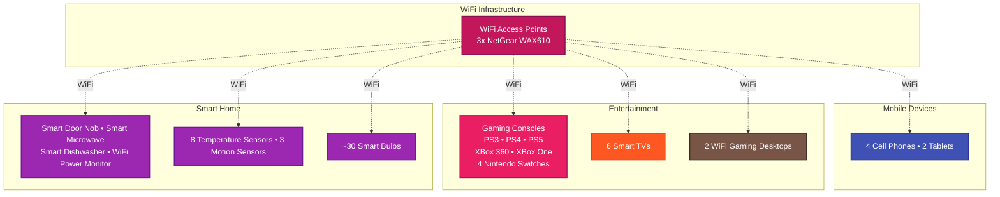

# Homelab Infrastructure

This repository contains the Ansible playbooks and configuration for managing my homelab infrastructure, including Raspberry Pis and other computers. The project includes automated deployment of Paperless-ngx for document management with encrypted cloud backups.

## Project Structure

```
.
├── ansible/                  # Ansible configuration and playbooks
│   ├── group_vars/          # Group variables
│   ├── host_vars/           # Host-specific variables
│   ├── inventory/           # Inventory files
│   ├── roles/              # Ansible roles
│   └── playbooks/          # Ansible playbooks
├── docs/                    # Additional documentation
├── .gitignore              # Git ignore file
└── README.md               # This file
```

## Network Layout



### WiFi/IoT Devices



### Network Components

- **Internet Provider**: Comcast
- **Modem**: Nighthawk CM300 DOCSIS 3.1 (2.5 Gbps)
- **Firewall**: OPNSense running on i7-7700 with 16GB RAM
- **Core Switch**: Unifi US-48-500W (48-port managed switch)
- **WiFi Access Points**: 3x NetGear WAX610 WiFi 6 AX1800
- **Mini Rack Switch**: TP-Link TL-SG105 (5-port gigabit unmanaged switch)
- **Services**: 
  - Raspberry Pi 4B running Paperless-ngx (192.168.0.45)
  - Raspberry Pi 3B running Houselights controller (192.168.1.121)
  - Raspberry Pi 4B running Home Assistant OS (192.168.0.43)
  - NAS Server (i7-9900, 16GB RAM, 10x 3TB HDD, FreeNAS/OpenNAS) - Under Construction
  - 3 Desktop Gaming Computers (Wired)
- **WiFi/IoT Devices**:
  - **Mobile**: 4 Cell Phones, 2 Tablets
  - **Gaming Consoles**: PS3, PS4, PS5, XBox 360, XBox One, 4 Nintendo Switches
  - **Gaming PCs**: 2 WiFi Gaming Desktops
  - **Smart Home**: Smart Door Nob, Smart Microwave, Smart Dishwasher, WiFi Power Monitor
  - **Sensors**: 8 Temperature Sensors, 3 Motion Sensors
  - **Lighting**: ~30 Smart Bulbs
  - **Entertainment**: 6 Smart TVs

### Custom Services
- `rpi4b-01`: Paperless-ngx document management stack
- `houselights`: Holiday lighting controller from [`deathbreakfast/house-lights`](https://github.com/deathbreakfast/house-lights)

## Documentation

For detailed setup and usage instructions, please refer to the [documentation](docs/README.md). The documentation includes:

- Step-by-step setup guides
- Device configuration instructions
- Security best practices
- Troubleshooting guides

## Security

- **Never commit sensitive data** to this repository
- Use Ansible Vault for encrypting sensitive information
- Store secrets in a separate secure location
- Use environment variables for sensitive data when possible

## Requirements

- Ansible 2.9 or later
- Python 3.6 or later
- SSH access to managed nodes

## Getting Started

1. Clone this repository
2. Install required dependencies:
   ```bash
   pip install -r requirements.txt
   ```
3. Create your inventory file in `ansible/inventory/`
4. Set up your SSH keys and access
5. Run your playbooks:
   ```bash
   ansible-playbook -i ansible/inventory/hosts ansible/playbooks/site.yml
   ```

## Inventory

The inventory is organized by device type and location. See `ansible/inventory/` for details.

### Current Devices
- **rpi4b-01** (192.168.0.45) - Raspberry Pi 4B running Paperless-ngx
- **houselights** (192.168.1.121) - Raspberry Pi 3B planned for holiday RGB lighting control

### Houselights Controller
The controller pulls code from [`deathbreakfast/house-lights`](https://github.com/deathbreakfast/house-lights) and runs it as a managed Flask service on the `houselights` Pi.

- Deploy / ensure service is running:
  ```bash
  ansible-playbook -i ansible/inventory/hosts ansible/playbooks/houselights.yml
  ```
- Pull latest code and restart gracefully:
  ```bash
  ansible-playbook -i ansible/inventory/hosts ansible/playbooks/houselights-update.yml
  ```

## Paperless-ngx

This project includes automated deployment of Paperless-ngx, a document management system that helps you go paperless. The deployment includes:

- Docker-based installation with PostgreSQL database
- Redis for task queue management
- OCR capabilities for document text extraction
- Web interface accessible at `http://192.168.0.45:8000`

### Deploying Paperless-ngx

To deploy Paperless-ngx on your Raspberry Pi:

```bash
ansible-playbook -i ansible/inventory/hosts ansible/playbooks/paperless.yml
```

Or include it in the main deployment:

```bash
ansible-playbook -i ansible/inventory/hosts ansible/playbooks/site.yml
```

## Backup System

The project includes an automated backup system for Paperless-ngx with:

- **Encrypted cloud storage** using rclone crypt
- **Automated daily backups** with cron scheduling
- **Automatic retention management** - keeps only 3 most recent backups
- **Backup verification** and integrity checks
- **Restore functionality** with safety measures
- **Multiple cloud providers** supported

### Deploying Backup System

```bash
ansible-playbook -i ansible/inventory/hosts ansible/playbooks/backup.yml
```

**Important**: Configure your cloud storage credentials and encryption passwords in `ansible/group_vars/raspberry_pis.yml` before deployment.

## Contributing

1. Fork the repository
2. Create a feature branch
3. Commit your changes
4. Push to the branch
5. Create a Pull Request

## License

MIT License - See LICENSE file for details 